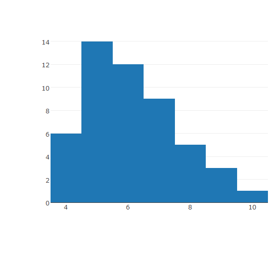
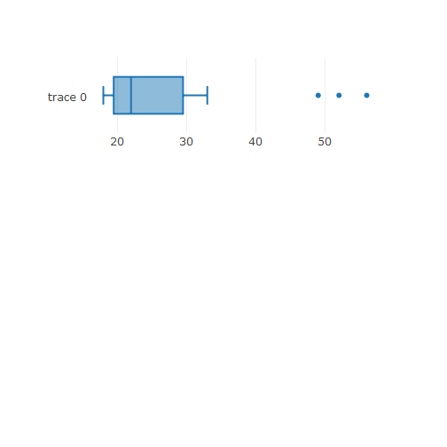

## Motivation


A smaller firm produces special coffee machines.

The number of machines per day varies day by day.
On 50 days the number of machines was determined.
Based on this sample statistical measures should be
calculated to describe the frequency distribution.

[See Youtube how these machines are working .]
(https://www.youtube.com/watch?v=e6sYCt1N1zI)

You will learn to:

- 1. Distinguish different measures of central tendency
- 2. Calculate the measures
- 3. Explain their advantages and disadvantages

---

## Motivation

RAW data allow to get a very detailed idea of the production capacity .


```r
num_per_day <- c(7,6,6,10,6,6,7,4,7,4,5,7,9,6,5,5,9,7,5,9,5,5,4,8,5,8,
           5,6,4,6,4,7,6,5,8,4,5,5,6,5,8,5,6,6,5,7,7,6,7,8)
machine <- as.data.frame(num_per_day)
```

but we need to have an managerial summary e.g. to be able to forecast.

1. Calculate different statistical measures based
on given RAW data: mean, mode, median.

First we can see a frecuency table: 


```r
table(machine)
```

```
machine
 4  5  6  7  8  9 10 
 6 14 12  9  5  3  1 
```

---
Now we can use the functions: `mean`, `median`, or just get all the data with the function `summary`.


```r
summary(machine)
```

```
  num_per_day   
 Min.   : 4.00  
 1st Qu.: 5.00  
 Median : 6.00  
 Mean   : 6.12  
 3rd Qu.: 7.00  
 Max.   :10.00  
```

To calculate the mode there is not built-in function in R, then we use one of the many ways to do it.


```r
as.numeric(names(sort(-table(machine)))[1])
```

```
[1] 5
```


---

2. Create a frequency distribution

For this example the library `plotly` will be used


```r
plot_ly(machine,x= num_per_day,width = 500,height = 400) %>% add_histogram()
```




---

## Measures of Central Tendency

- The `mode` is the value with the highest frequency.

- The `mean` of a set of observations is their average.

It is equal to the sum of all observations divided by the number of observations in
the set.

$$latex
f(\bar{x}) = \frac{1}{n}{\sum_{n=1}^{n}x_n}
$$


   - If the frequency table is given:
  
$$latex
f(\bar{x}) = \frac{1}{n}{\sum_{n=1}^{m}{x_i}{h(x_i)}} = {\sum_{n=1}^{m}{x_i}{f(x_i)}}
$$

- The `median` is the value which accounts for the bottom 50 % of the values. If the
values are ordered it equals the value "in the middle".

---
## Percentiles / Quantiles

- The position within this group is defined in terms of a percentile!

- `Definition of a percentile:`

The Pth `percentile` of a group of numbers is the value below which lie P% (P
percent) of the numbers in the group. The position of the Pth percentile is given by
(n +1)*P/100, where n is the sample size.

- `Example:` World's 20 wealthiest individuals published by magazine Forbes (ordered): 


```r
wealth <- c(18,18,18,18,19,20,20,20,21,22,22,23,24,26,27,32,33,49,52,56)
forbes <- as.data.frame(wealth)
```

---

Find the 50th and 80th percentiles of this set of the world's top 20 net worths!
With the funtion `quantile` the respective quantiles are given.


```r
quantile(forbes$wealth,probs = c(0.5,0.8))
```

```
 50%  80% 
22.0 32.2 
```

A boxplot is shown to see the distribution of the data.


```r
plot_ly(forbes,x= wealth,width = 400,height = 150) %>% add_boxplot()
```



---

## Summary

1. Explain how to calculate mode, median and mean based on RAW data.

2. The following table shows a tabular comparison of scales of measurements and
measures of central tendency. Fill in the details and explain your decision in detail!

            | Nominal     | Ordinal    |Metrical    | 
------------| ------------|------------|------------|
Mode        | 
Median      |
Mean        |


3. Define the term percentile/quantile and quartile.


